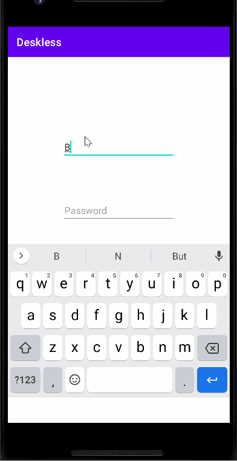
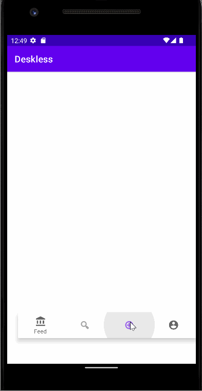

Original App Design Project - README Template
===

# DESKLESS

## Table of Contents
1. [Overview](#Overview)
1. [Product Spec](#Product-Spec)
1. [Wireframes](#Wireframes)
2. [Schema](#Schema)

## Overview
### Description
Deskless is a social app that allows remote workers to connect with each other and find the best remote working locations

### App Evaluation

- **Category: Social 
- **Mobile: Website is view only, uses location, mobile first experience
- **Story: Remote workers who are tired of the same old work desk Set up, exhausted with going to their favorite local coffee shop and having it crowded and noisy or tired of working alone and missing out on the perks of an office space with fellow co-workers or people in similar situations have this app as a one stop shop for alleviating these problems.
- **Market: Remote workers searching for new working spaces, or to engage with other remote workers in a new environment would enjoy this app.  
- **Habit: Remote employees can log into the app whenever to view work-friendly, co-working and co-living spaces near them in whatever location they are in
- **Scope: Deskless scope focuses on finding remote work locations in proximity to its users 

## Product Spec

### 1. User Stories (Required and Optional)
* Users can create their own user profiles 
* Users can view working locations in close proximity to their location such as restaurants, co-working and/or co-living space
* Users can also rate locations and leave reviews as well 
* Users can create events where other users can opt in via the homefeed
* Users can limit how many attendees can attend their event


**Optional Stories**

* Users can tag and message other users
* Users can share locations via link


### 2. Screen Archetypes

* Login 
   - [x] User can Sign Up
   * [x] User can login to their profile
   * [x] User Remains Logged-in
   * [x] User can log out


GIF created with [LiceCap](http://www.cockos.com/licecap/).

* Homefeed/ Stream
   * [x] User can view events posted by other users

* Creation
   * [x] User can create their own events and allow others to register within its limit
   * [x] User can take photos and add it to the image description 
   

* Location
   * [ ] User can search for, and/or view remote working locations

* Profile
   * [x] User can create the profile based on work place, and interests

* Setting
   * [x] User can update their profile


### 3. Navigation

**Tab Navigation** (Tab to Screen)

* Homefeed
* Search/ view locations in user's current location
* Post an event
* Setting

**Flow Navigation** (Screen to Screen)

Login Screen
=> Home
User registration Screen
=> Home
Homefeed Screen
=> Event registration screen
Creation Screen
=> Home (after you finish posting an event)

Search Screen
=> None

## Wireframes
[Add picture of your hand sketched wireframes in this section]


### [BONUS] Digital Wireframes & Mockups


### [BONUS] Interactive Prototype

## Schema 
[This section will be completed in Unit 9]

### Models
Model: User Login and Sign Up
| Property      | Type  | Description |
| :------------ |:---------------| :-----|
| username      | String          |stores the username of the login user  |
| password      | String          |stores the password of the user |
| email         | String          |stores the email of the user |
| firstname     | String          |stores the firstname of the user |
| lastname      | String          |stores the lastname of the user |
| role          | String          |stores the role of the user |
| createdAt     | DateTime         |date when post is created (default field)|
| updatedAt     | DateTime          |date when post is last updated (default field)|


Model: Post
| Property  | Type  | Description |
| :------------ |:---------------| :-----|
| authorRole     | pointer to role  |post author's role|
| author      | pointer to user  |post author|
| location      | geolocation  |stores the location of the post|
| image     | file       |  stores the image to be posted |
| description | String        |  stores the description of the user |
| createdAt     |DateTime         |date when post is created (default field)|
|vibe   | String| Stores the atmosphere expected at the event|
|amenities|String|Stores the necessary qualities at the event|
|maxAmountofPeople|Integer|stores the maximum number of people allowed at the event|
|timePeriod|Float|stores the duration of the event in hours|


Model: User Profile
| Property      | Type  | Description |
| :------------ |:---------------| :-----|
| username      | String          |stores the username of the login user  |
| password      | String          |stores the password of the user |
| email         | String          |stores the email of the user |
| firstname     | String          |stores the firstname of the user |
| lastname      | String          |stores the lastname of the user |
| role          | String          |stores the role of the user |
| createdAt     | DateTime         |date when post is created (default field)|
| updatedAt     | DateTime          |date when post is last updated (default field)|
| profileImage     | file       |  stores the profile image to be posted |


### Networking
User Profile Screen
* (Read/GET) Query logged in user object.
* (Update/PUT) Update user profile image.
* (Update/PUT) update user role.

Create Post Screen
* (Create/POST) Create a new post object.

Home Feed where users see events
* (Read/GET) Query all posts.
* (Create/POST) Create a new join on a post to join an event.
* (Delete) Delete an existing join on a post to withdraw from a posted event.

Location screen
* (Read/GET) Query all events at places close by within a certain raduis.


[Create basic snippets for each Parse network request]
* Delete
```swift
myObject.deleteInBackground();
```

* Create
 ```swift
ParseObject post = new ParseObject("Post");
post.put("author", authorObject);
post.put("authorRole", "Software Engineer");
post.put("location", locationObject);
post.put("vibe", "Quite");
post.put("amenities", "wifi");
post.put("timePeriod", 1);
post.put("maxNumofPeople", 10);
post.put("description", "Come for a change in scenary");
post.saveEventually();
```

* Read
 ```swift
let query = PFQuery(className:"Post")
query.whereKey("userLocation", equalTo: currentLocation)
query.order(byDescending: "locationDistance")
query.findObjectsInBackground { (posts: [PFObject]?, error: Error?) in
   if let error = error {
      print(error.localizedDescription)
   } else if let posts = posts {
      print("Successfully retrieved \(posts.count) posts.")
      // TODO: Do something with posts...
   }
}
```

* Update
    ParseQuery<ParseObject> query = ParseQuery.getQuery("GameScore");
  
    ```swift
    // Retrieve the object by id
   
    query.getInBackground("xWMyZ4YEGZ", new GetCallback<ParseObject>() {
        public void done(ParseObject user, ParseException e) {
            if (e == null) {
                // Now let's update it with some new data. In this case, only cheatMode and score
                // will get sent to your Parse Server. playerName hasn't changed.
                user.put("username", "Clinton");
                user.put("role", "Data Scientist");
                user.saveInBackground();
            }
        }
    });
  ```


[OPTIONAL: List endpoints if using existing API such as Yelp]
